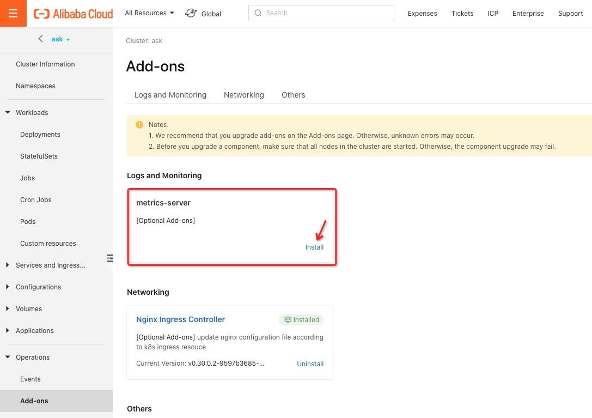

- [对比 X](#对比-x)
  * [KubeVela 和 Helm 的区别?](#kubevela-和-helm-有什么区别)

- [问题](#问题)
  - [Error: unable to create new content in namespace cert-manager because it is being terminated](#error-unable-to-create-new-content-in-namespace-cert-manager-because-it-is-being-terminated)
  - [Error: ScopeDefinition exists](#error-scopedefinition-exists)
  - [You have reached your pull rate limit](#you-have-reached-your-pull-rate-limit)
  - [Warning: Namespace cert-manager exists](#warning-namespace-cert-manager-exists)
  - [如何修复问题: MutatingWebhookConfiguration mutating-webhook-configuration exists?](#如何修复问题：mutatingwebhookconfiguration-mutating-webhook-configuration-exists)

- [运维](#运维)
  * [Autoscale：如何在多个 Kkubernetes 集群上开启 metrics server？](#autoscale-如何在多个-kubernetes-集群上开启-metrics-server-？)
  
## 对比 X

### KubeVela 和 Helm 有什么区别?

KubeVela 是一个平台构建工具，用于创建基于 Kubernete 的易使用、可拓展的应用交付/管理系统。KubeVela 将 Helm 作为模板引擎和应用包的标准。但是 Helm 不是 KubeVela 唯一支持的模板模块。另一个同样最优先支持的是 CUE。

同时，KubeVale 被设计为 Kubernetes 的一个控制器（即工作在服务端）,即使是其 Helm 部分，也会安装一个 Helm Operator。 

## 问题

### Error: unable to create new content in namespace cert-manager because it is being terminated

你可能偶尔会碰到如下问题。它发生在上一个 KubeVele 版本没有删除完成时。

```
$ vela install
- Installing Vela Core Chart:
install chart vela-core, version 0.1.0, desc : A Helm chart for Kube Vela core, contains 35 file
Failed to install the chart with error: serviceaccounts "cert-manager-cainjector" is forbidden: unable to create new content in namespace cert-manager because it is being terminated
failed to create resource
helm.sh/helm/v3/pkg/kube.(*Client).Update.func1
	/home/runner/go/pkg/mod/helm.sh/helm/v3@v3.2.4/pkg/kube/client.go:190
...
Error: failed to create resource: serviceaccounts "cert-manager-cainjector" is forbidden: unable to create new content in namespace cert-manager because it is being terminated
```

稍事休息，然后在几秒内重试。

```
$ vela install
- Installing Vela Core Chart:
Vela system along with OAM runtime already exist.
Automatically discover capabilities successfully ✅ Add(0) Update(0) Delete(8)

TYPE       	CATEGORY	DESCRIPTION
-task      	workload	One-off task to run a piece of code or script to completion
-webservice	workload	Long-running scalable service with stable endpoint to receive external traffic
-worker    	workload	Long-running scalable backend worker without network endpoint
-autoscale 	trait   	Automatically scale the app following certain triggers or metrics
-metrics   	trait   	Configure metrics targets to be monitored for the app
-rollout   	trait   	Configure canary deployment strategy to release the app
-route     	trait   	Configure route policy to the app
-scaler    	trait   	Manually scale the app

- Finished successfully.
```

手动应用所有 WorkloadDefinition 和 TraitDefinition manifests 以恢复所有功能。

```
$ kubectl apply -f charts/vela-core/templates/defwithtemplate
traitdefinition.core.oam.dev/autoscale created
traitdefinition.core.oam.dev/scaler created
traitdefinition.core.oam.dev/metrics created
traitdefinition.core.oam.dev/rollout created
traitdefinition.core.oam.dev/route created
workloaddefinition.core.oam.dev/task created
workloaddefinition.core.oam.dev/webservice created
workloaddefinition.core.oam.dev/worker created

$ vela workloads
Automatically discover capabilities successfully ✅ Add(8) Update(0) Delete(0)

TYPE       	CATEGORY	DESCRIPTION
+task      	workload	One-off task to run a piece of code or script to completion
+webservice	workload	Long-running scalable service with stable endpoint to receive external traffic
+worker    	workload	Long-running scalable backend worker without network endpoint
+autoscale 	trait   	Automatically scale the app following certain triggers or metrics
+metrics   	trait   	Configure metrics targets to be monitored for the app
+rollout   	trait   	Configure canary deployment strategy to release the app
+route     	trait   	Configure route policy to the app
+scaler    	trait   	Manually scale the app

NAME      	DESCRIPTION
task      	One-off task to run a piece of code or script to completion
webservice	Long-running scalable service with stable endpoint to receive external traffic
worker    	Long-running scalable backend worker without network endpoint
```

### Error: ScopeDefinition exists

你可能偶尔会碰到如下问题。它发生在存在一个老的 OAM Kubernetes Runtime 发行版时，或者你之前已经部署过 `ScopeDefinition` 。 

```
$ vela install
  - Installing Vela Core Chart:
  install chart vela-core, version 0.1.0, desc : A Helm chart for Kube Vela core, contains 35 file
  Failed to install the chart with error: ScopeDefinition "healthscopes.core.oam.dev" in namespace "" exists and cannot be imported into the current release: invalid ownership metadata; annotation validation error: key "meta.helm.sh/release-name" must equal "kubevela": current value is "oam"; annotation validation error: key "meta.helm.sh/release-namespace" must equal "vela-system": current value is "oam-system"
  rendered manifests contain a resource that already exists. Unable to continue with install
  helm.sh/helm/v3/pkg/action.(*Install).Run
  	/home/runner/go/pkg/mod/helm.sh/helm/v3@v3.2.4/pkg/action/install.go:274
  ...
  Error: rendered manifests contain a resource that already exists. Unable to continue with install: ScopeDefinition "healthscopes.core.oam.dev" in namespace "" exists and cannot be imported into the current release: invalid ownership metadata; annotation validation error: key "meta.helm.sh/release-name" must equal "kubevela": current value is "oam"; annotation validation error: key "meta.helm.sh/release-namespace" must equal "vela-system": current value is "oam-system"
```

删除 `ScopeDefinition` "healthscopes.core.oam.dev" 然后重试.

```
$ kubectl delete ScopeDefinition "healthscopes.core.oam.dev"
scopedefinition.core.oam.dev "healthscopes.core.oam.dev" deleted

$ vela install
- Installing Vela Core Chart:
install chart vela-core, version 0.1.0, desc : A Helm chart for Kube Vela core, contains 35 file
Successfully installed the chart, status: deployed, last deployed time = 2020-12-03 16:26:41.491426 +0800 CST m=+4.026069452
WARN: handle workload template `containerizedworkloads.core.oam.dev` failed: no template found, you will unable to use this workload capabilityWARN: handle trait template `manualscalertraits.core.oam.dev` failed
: no template found, you will unable to use this trait capabilityAutomatically discover capabilities successfully ✅ Add(8) Update(0) Delete(0)

TYPE       	CATEGORY	DESCRIPTION
+task      	workload	One-off task to run a piece of code or script to completion
+webservice	workload	Long-running scalable service with stable endpoint to receive external traffic
+worker    	workload	Long-running scalable backend worker without network endpoint
+autoscale 	trait   	Automatically scale the app following certain triggers or metrics
+metrics   	trait   	Configure metrics targets to be monitored for the app
+rollout   	trait   	Configure canary deployment strategy to release the app
+route     	trait   	Configure route policy to the app
+scaler    	trait   	Manually scale the app

- Finished successfully.
```

### You have reached your pull rate limit

当你查看 Pod kubevela-vela-core 的日志并发现如下问题时。

```
$ kubectl get pod -n vela-system -l app.kubernetes.io/name=vela-core
NAME                                 READY   STATUS    RESTARTS   AGE
kubevela-vela-core-f8b987775-wjg25   0/1     -         0          35m
```

>Error response from daemon: toomanyrequests: You have reached your pull rate limit. You may increase the limit by 
>authenticating and upgrading: https://www.docker.com/increase-rate-limit
 
你可以换成 github 的镜像仓库。

```
$ docker pull ghcr.io/oam-dev/kubevela/vela-core:latest
```

### Warning: Namespace cert-manager exists

如果碰到以下问题，则可能存在一个 `cert-manager` 发行版，其 namespace 及 RBAC 相关资源与 KubeVela 存在冲突。

```
$ vela install
- Installing Vela Core Chart:
install chart vela-core, version 0.1.0, desc : A Helm chart for Kube Vela core, contains 35 file
Failed to install the chart with error: Namespace "cert-manager" in namespace "" exists and cannot be imported into the current release: invalid ownership metadata; label validation error: missing key "app.kubernetes.io/managed-by": must be set to "Helm"; annotation validation error: missing key "meta.helm.sh/release-name": must be set to "kubevela"; annotation validation error: missing key "meta.helm.sh/release-namespace": must be set to "vela-system"
rendered manifests contain a resource that already exists. Unable to continue with install
helm.sh/helm/v3/pkg/action.(*Install).Run
        /home/runner/go/pkg/mod/helm.sh/helm/v3@v3.2.4/pkg/action/install.go:274
...
        /opt/hostedtoolcache/go/1.14.12/x64/src/runtime/asm_amd64.s:1373
Error: rendered manifests contain a resource that already exists. Unable to continue with install: Namespace "cert-manager" in namespace "" exists and cannot be imported into the current release: invalid ownership metadata; label validation error: missing key "app.kubernetes.io/managed-by": must be set to "Helm"; annotation validation error: missing key "meta.helm.sh/release-name": must be set to "kubevela"; annotation validation error: missing key "meta.helm.sh/release-namespace": must be set to "vela-system"
```

尝试如下步骤修复这个问题。

- 删除 `cert-manager` 发行版
- 删除 `cert-manager` namespace 
- 重装 KubeVela

```
$ helm delete cert-manager -n cert-manager
release "cert-manager" uninstalled

$ kubectl delete ns cert-manager
namespace "cert-manager" deleted

$ vela install
- Installing Vela Core Chart:
install chart vela-core, version 0.1.0, desc : A Helm chart for Kube Vela core, contains 35 file
Successfully installed the chart, status: deployed, last deployed time = 2020-12-04 10:46:46.782617 +0800 CST m=+4.248889379
Automatically discover capabilities successfully ✅ (no changes)

TYPE      	CATEGORY	DESCRIPTION
task      	workload	One-off task to run a piece of code or script to completion
webservice	workload	Long-running scalable service with stable endpoint to receive external traffic
worker    	workload	Long-running scalable backend worker without network endpoint
autoscale 	trait   	Automatically scale the app following certain triggers or metrics
metrics   	trait   	Configure metrics targets to be monitored for the app
rollout   	trait   	Configure canary deployment strategy to release the app
route     	trait   	Configure route policy to the app
scaler    	trait   	Manually scale the app
- Finished successfully.
```

### 如何修复问题：MutatingWebhookConfiguration mutating-webhook-configuration exists?

如果你部署的其他服务会安装 MutatingWebhookConfiguration mutating-webhook-configuration，则安装 KubeVela 时会碰到如下问题。

```shell
- Installing Vela Core Chart:
install chart vela-core, version v0.2.1, desc : A Helm chart for Kube Vela core, contains 36 file
Failed to install the chart with error: MutatingWebhookConfiguration "mutating-webhook-configuration" in namespace "" exists and cannot be imported into the current release: invalid ownership metadata; label validation error: missing key "app.kubernetes.io/managed-by": must be set to "Helm"; annotation validation error: missing key "meta.helm.sh/release-name": must be set to "kubevela"; annotation validation error: missing key "meta.helm.sh/release-namespace": must be set to "vela-system"
rendered manifests contain a resource that already exists. Unable to continue with install
helm.sh/helm/v3/pkg/action.(*Install).Run
	/home/runner/go/pkg/mod/helm.sh/helm/v3@v3.2.4/pkg/action/install.go:274
github.com/oam-dev/kubevela/pkg/commands.InstallOamRuntime
	/home/runner/work/kubevela/kubevela/pkg/commands/system.go:259
github.com/oam-dev/kubevela/pkg/commands.(*initCmd).run
	/home/runner/work/kubevela/kubevela/pkg/commands/system.go:162
github.com/oam-dev/kubevela/pkg/commands.NewInstallCommand.func2
	/home/runner/work/kubevela/kubevela/pkg/commands/system.go:119
github.com/spf13/cobra.(*Command).execute
	/home/runner/go/pkg/mod/github.com/spf13/cobra@v1.1.1/command.go:850
github.com/spf13/cobra.(*Command).ExecuteC
	/home/runner/go/pkg/mod/github.com/spf13/cobra@v1.1.1/command.go:958
github.com/spf13/cobra.(*Command).Execute
	/home/runner/go/pkg/mod/github.com/spf13/cobra@v1.1.1/command.go:895
main.main
	/home/runner/work/kubevela/kubevela/references/cmd/cli/main.go:16
runtime.main
	/opt/hostedtoolcache/go/1.14.13/x64/src/runtime/proc.go:203
runtime.goexit
	/opt/hostedtoolcache/go/1.14.13/x64/src/runtime/asm_amd64.s:1373
Error: rendered manifests contain a resource that already exists. Unable to continue with install: MutatingWebhookConfiguration "mutating-webhook-configuration" in namespace "" exists and cannot be imported into the current release: invalid ownership metadata; label validation error: missing key "app.kubernetes.io/managed-by": must be set to "Helm"; annotation validation error: missing key "meta.helm.sh/release-name": must be set to "kubevela"; annotation validation error: missing key "meta.helm.sh/release-namespace": must be set to "vela-system"
```

要解决这个问题，请从 [KubeVela releases](https://github.com/oam-dev/kubevela/releases) 将 KubeVela Cli `vela` 版本升级到 `v0.2.2` 以上。

## 运维

### Autoscale: 如何在多个 Kubernetes 集群上开启 metrics server ？

运维 Autoscale 依赖 metrics server，所以它在许多集群中都是开启的。请通过命令 `kubectl top nodes` 或 `kubectl top pods` 检查 metrics server 是否开启。

如果输出如下相似内容，那么 metrics 已经开启。

```shell
$ kubectl top nodes
NAME                     CPU(cores)   CPU%   MEMORY(bytes)   MEMORY%
cn-hongkong.10.0.1.237   288m         7%     5378Mi          78%
cn-hongkong.10.0.1.238   351m         8%     5113Mi          74%

$ kubectl top pods
NAME                          CPU(cores)   MEMORY(bytes)
php-apache-65f444bf84-cjbs5   0m           1Mi
wordpress-55c59ccdd5-lf59d    1m           66Mi
```

或者需要在你的 kubernetes 集群中手动开启 metrics 。

- ACK (Alibaba Cloud Container Service for Kubernetes)

Metrics server 已经开启。

- ASK (Alibaba Cloud Serverless Kubernetes)

Metrics server 已经在如下 [Alibaba Cloud console](https://cs.console.aliyun.com/) `Operations/Add-ons` 部分开启。



如果你有更多问题，请访问 [metrics server 排错指导](https://help.aliyun.com/document_detail/176515.html) 。

- Kind

使用如下命令安装 metrics server，或者可以安装 [最新版本](https://github.com/kubernetes-sigs/metrics-server#installation)。

```shell
$ kubectl apply -f https://github.com/kubernetes-sigs/metrics-server/releases/download/v0.3.7/components.yaml
```

并且在通过 `kubectl edit deploy -n kube-system metrics-server` 加载的 yaml 文件中 `.spec.template.spec.containers` 下增加如下部分。

注意：这里只是一个示例，而不是用于生产级别的使用。

```
command:
- /metrics-server
- --kubelet-insecure-tls
```

- MiniKube

使用如下命令开启。

```shell
$ minikube addons enable metrics-server
```


享受在你的应用中 [设置 autoscale](../../extensions/set-autoscale)。
