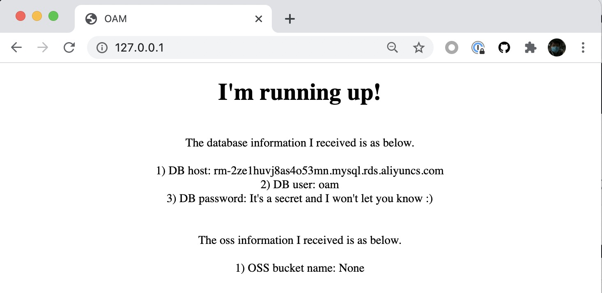

KubeVela 允许您在一致的 API 中声明您的应用程序所需的云服务。 目前，我们同时支持 Terraform 和 Crossplane。

> 如果您对 KubeVela 中如何维护这些功能感兴趣，请查看 [云服务平台团队指南](../../platform-engineers/cloud-services)。

应用程序将通过 [Service Binding Trait](../traits/service-binding) 使用云服务。

## Terraform

> ⚠️ 本节假设 [Terraform 相关功能](../../platform-engineers/terraform) 已安装在您的平台中。

检查云资源 component 和 trait 的参数。

```shell
kubectl vela show alibaba-rds
```
```console
# Properties
+----------------------------+-------------------------------------------------------------------------+-----------------------------------------------------------+----------+---------+
|            NAME            |                               DESCRIPTION                               |                           TYPE                            | REQUIRED | DEFAULT |
+----------------------------+-------------------------------------------------------------------------+-----------------------------------------------------------+----------+---------+
| bucket                     | OSS bucket name                                                         | string                                                    | true     |         |
| acl                        | OSS bucket ACL, supported 'private', 'public-read', 'public-read-write' | string                                                    | true     |         |
| writeConnectionSecretToRef | The secret which the cloud resource connection will be written to       | [writeConnectionSecretToRef](#writeConnectionSecretToRef) | false    |         |
+----------------------------+-------------------------------------------------------------------------+-----------------------------------------------------------+----------+---------+


## writeConnectionSecretToRef
+-----------+-----------------------------------------------------------------------------+--------+----------+---------+
|   NAME    |                                 DESCRIPTION                                 |  TYPE  | REQUIRED | DEFAULT |
+-----------+-----------------------------------------------------------------------------+--------+----------+---------+
| name      | The secret name which the cloud resource connection will be written to      | string | true     |         |
| namespace | The secret namespace which the cloud resource connection will be written to | string | false    |         |
+-----------+-----------------------------------------------------------------------------+--------+----------+---------+

```
```shell
kubectl vela show service-binding
```
```console
# Properties
+-------------+------------------------------------------------+------------------+----------+---------+
|    NAME     |                  DESCRIPTION                   |       TYPE       | REQUIRED | DEFAULT |
+-------------+------------------------------------------------+------------------+----------+---------+
| envMappings | The mapping of environment variables to secret | map[string]{...} | true     |         |
+-------------+------------------------------------------------+------------------+----------+---------+
```

### Alibaba Cloud RDS and OSS

示例 [application](https://github.com/oam-dev/kubevela/tree/master/docs/examples/terraform/cloud-resource-provision-and-consume/application.yaml) 如下。

```yaml
apiVersion: core.oam.dev/v1beta1
kind: Application
metadata:
  name: webapp
spec:
  components:
    - name: express-server
      type: webservice
      properties:
        image: zzxwill/flask-web-application:v0.3.1-crossplane
        ports: 80
      traits:
        - type: service-binding
          properties:
            envMappings:
              # environments refer to db-conn secret
              DB_PASSWORD:
                secret: db-conn                                   # 1) If the env name is the same as the secret key, secret key can be omitted.
              endpoint:
                secret: db-conn
                key: DB_HOST                                      # 2) If the env name is different from secret key, secret key has to be set.
              username:
                secret: db-conn
                key: DB_USER
              # environments refer to oss-conn secret
              BUCKET_NAME:
                secret: oss-conn

    - name: sample-db
      type: alibaba-rds
      properties:
        instance_name: sample-db
        account_name: oamtest
        password: U34rfwefwefffaked
        writeConnectionSecretToRef:
          name: db-conn

    - name: sample-oss
      type: alibaba-oss
      properties:
        bucket: vela-website
        acl: private
        writeConnectionSecretToRef:
          name: oss-conn


```

## Crossplane

> ⚠️ 本节假设你的平台已经安装了【Crossplane 相关功能】(../../platform-engineers/crossplane)。

### 阿里云RDS和OSS

查看云服务组件参数：

```shell
kubectl vela show alibaba-rds
```
```console
# Properties
+---------------+------------------------------------------------+--------+----------+--------------------+
|     NAME      |                  DESCRIPTION                   |  TYPE  | REQUIRED |      DEFAULT       |
+---------------+------------------------------------------------+--------+----------+--------------------+
| engine        | RDS engine                                     | string | true     | mysql              |
| engineVersion | The version of RDS engine                      | string | true     |                8.0 |
| instanceClass | The instance class for the RDS                 | string | true     | rds.mysql.c1.large |
| username      | RDS username                                   | string | true     |                    |
| secretName    | Secret name which RDS connection will write to | string | true     |                    |
+---------------+------------------------------------------------+--------+----------+--------------------+
```
示例应用程序如下。

```yaml
apiVersion: core.oam.dev/v1beta1
kind: Application
metadata:
  name: webapp
spec:
  components:
    - name: express-server
      type: webservice
      properties:
        image: zzxwill/flask-web-application:v0.3.1-crossplane
        ports: 80
      traits:
        - type: service-binding
          properties:
            envMappings:
              # environments refer to db-conn secret
              DB_PASSWORD:
                secret: db-conn
                key: password                                     # 1) If the env name is different from secret key, secret key has to be set.
              endpoint:
                secret: db-conn                                   # 2) If the env name is the same as the secret key, secret key can be omitted.
              username:
                secret: db-conn
              # environments refer to oss-conn secret
              BUCKET_NAME:
                secret: oss-conn
                key: Bucket

    - name: sample-db
      type: alibaba-rds
      properties:
        name: sample-db
        engine: mysql
        engineVersion: "8.0"
        instanceClass: rds.mysql.c1.large
        username: oamtest
        secretName: db-conn

    - name: sample-oss
      type: alibaba-oss
      properties:
        name: velaweb
        secretName: oss-conn
```

## 验证

部署并验证应用程序（通过任一提供商都可以）。

```shell
kubectl get application
```
```console
NAME     AGE
webapp   46m
```
```shell
kubectl port-forward deployment/express-server 80:80
```
```console
Forwarding from 127.0.0.1:80 -> 80
Forwarding from [::1]:80 -> 80
Handling connection for 80
Handling connection for 80
```


