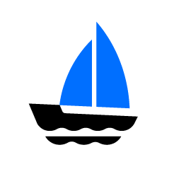

## 动机

云原生技术正在以 Kubernetes 作为通用抽象层，朝着跨云追求一致的应用交付迈进。Kubernetes 虽然在底层基础结构细节抽象方面表现出色，但带来了额外的复杂性，应用程序开发人员需要了解 Pod、端口暴露、权限、资源声明和管理、 CRD 等概念。我们看到了陡峭的学习曲线，缺乏面向开发人员的抽象影响了用户体验，降低了生产率，导致了生产中的意外错误或配置错误。人们开始质疑这场革命的价值：“我为什么要烦恼所有这些细节？”。

另一方面，抽象 Kubernetes 来满足开发人员的需求是一个非常依赖经验判断的过程，只有在决策者是平台构建者的情况下，最终的抽象才有意义。不幸的是，当今的平台构建者面临以下难题：

*没有工具或框架可让他们轻松构建用户友好且高度可扩展的抽象*

因此，尽管 Kubernetes 具有可扩展性，但许多平台至今基本上都是使用内部附加机制进行的受限抽象。这种方式几乎无法满足开发人员的需求，且无法将其扩展到更广泛的场景，更不用说充分利用丰富的 Kubernetes 生态系统。

最终结果是，开发人员抱怨这些平台过于僵化，响应功能要求或改进速度太慢。平台建设者确实希望提供帮助，但是工程上的努力却是艰巨的：平台中任何简单的 API 更改都可能很容易成为围绕经验主义进行抽象设计的马拉松式谈判。

## 什么是 KubeVela？

对于平台开发人员而言，KubeVela 作为框架，通过执行以下操作来减轻构建以开发人员为中心的平台的烦恼：

- 以开发人员为中心。KubeVela 通过引入 * Application * 的概念来抽象基础架构级别的原语，从而捕获微服务的完整部署，然后根据应用程序的需求构建操作功能。

- 本地扩展。* Application * 由模块化的构建块组成，这些构建模块支持 [CUELang](https://github.com/cuelang/cue) 和 [Helm](https://helm.sh) 作为模板引擎。这使你能够以乐高风格抽象 Kubernetes 的功能，并通过简单的 `kubectl apply -f` 将它们发布给最终用户。对抽象模板所做的更改将在运行时生效，无需重新编译或重新部署 KubeVela。

- 简单而可靠的抽象机制。与大多数 IaC(基础设施即代码)解决方案不同，KubeVela 中的抽象是用 [Kubernetes Control Loop](https://kubernetes.io/docs/concepts/architecture/controller/) 构建的，所以它们永远不会在集群中留下配置漂移。作为 [Kubernetes 自定义资源](https://kubernetes.io/docs/concepts/extend-kubernetes/api-extension/custom-resources/)，KubeVela可以与任何 CI/CD 或 GitOps 工具无缝协作，不需要进行集成工作。

有了 KubeVela，平台构建者终于有了工具支持，可以设计易于使用的抽象，并以高信心和低周转时间将它们交付给终端用户。

对于终端用户(例如应用程序开发人员)来说，这种用 KubeVela 构建的抽象将使他们能够以最少的努力设计并向 Kubernetes 发布应用程序 —他们要做的只是定义一个简单的应用程序，可以轻松地与任何 CI/CD 集成，而不需要管理一些基础设施细节。

## 比较

### KubeVela vs. 平台即服务 (PaaS) 

典型的例子是 Heroku 和 Cloud Foundry。它们提供完整的应用程序管理功能旨在提高开发人员的体验和效率。在这种情况下，KubeVela 可以提供类似的体验。

最大的区别在于**灵活性**。

KubeVela 是一个 Kubernetes 插件，它允许您通过定义自己的抽象来简单地为最终用户服务，这是通过将 Kubernetes API 资源模板化为集群中以应用程序为中心的抽象来实现的。与这种机制相比，现有的大多数 PaaS 系统受到严格限制不够灵活，也就是说，他们必须对所支持的应用程序和功能的类型实施约束，并且随着应用程序需求的增长，它们总是超出 PaaS 系统的能力 - 这在 KubeVela 中永远不会发生。

### KubeVela vs. Serverless 

无服务器平台(如 AWS Lambda)为部署无服务器应用程序提供了非凡的用户体验和灵活性。然而，这些平台在可扩展性方面施加了更多的限制。它们可以说是“硬编码”的 PaaS。

Kubernetes 基于无服务器的平台，如 Knative,OpenFaaS 通过将它们自己注册为新的 workload 和 traits 可以很容易与 KubeVela 集成。即使是 AWS Lambda，也有一个通过 Crossplane 开发的工具将其与 KubeVela 集成的成功案例。

### KubeVela vs. 平台无关的开发人员工具

典型的例子是 Hashicorp Waypoint。Waypoint 是一个面向开发人员的工具，它引入了一致的工作流(即构建、部署、发布)在不同平台上发布应用程序。

KubeVela 可以作为一个受支持的平台集成到 Waypoint 中。在这种情况下，开发人员可以使用 Waypoint 工作流来管理应用程序，利用 KubeVela 构建的抽象(例如 application、rollout、ingress、autoscaling 等)。

### KubeVela vs. Helm 

Helm 是 Kubernetes 的一个包管理器，为 Kubernetes 提供打包、安装和升级一组 YAML 文件。KubeVela 充分利用 Helm 来打包功能依赖，而且 Helm 也是*应用程序*抽象背后的核心模板引擎之一。

尽管 KubeVela 本身不是一个包管理器，但它是平台构建者的核心引擎，用于以简单和可重复的方式创建上层平台。

### KubeVela vs. Kubernetes

KubeVela 是一个 Kubernetes 插件，用于构建更高级别的抽象。它利用 [Open Application Model](https://github.com/oam-dev/spec) 和本地 Kubernetes 的可扩展性来解决一个困难的问题 -- 让在 Kubernetes 上发布应用程序变得愉快。

## 入门

现在，让我们[开始](./quick-start.md)使用 KubeVela！
