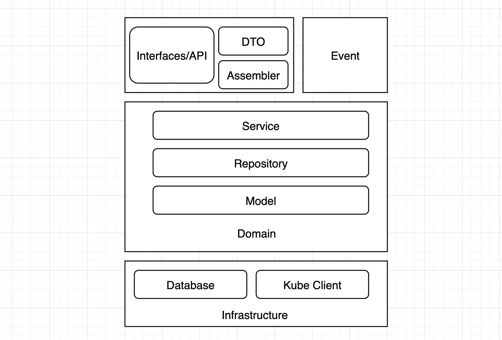

# APIServer Module Architecture

## Interfaces

Typically, it includes user interfaces, web services, and so on.

* API

Define the Restful API and perform basic validation on user input parameters.

* DTO

The carrier of data transmission. Here does not have any business logic inside, and the internal domain models can be isolated from the outside world through DTO.

* Assembler

Realize the mutual conversion and data exchange between DTO and DO.

## Event

Asynchronous task module. All workers under this module only run on the master node. Domain layer can be called.

## Domain

Code related to core business logic.

* Service

A domain service is a piece of business logic composed of multiple entities. You can put all domain services in the aggregate in one domain service class, or you can design each domain service as a class.

* Repository

Usually includes repository interface and repository implementation method. In order to facilitate the splitting and combination of aggregates, the principle is set: one aggregate corresponds to one repository. For example, save user information to a database.

* Model

Database model entity.

## Infrastructure

Provide general technical basic services for other layers, such as:

* Database
* Cache
* Kube Client
* MQ
